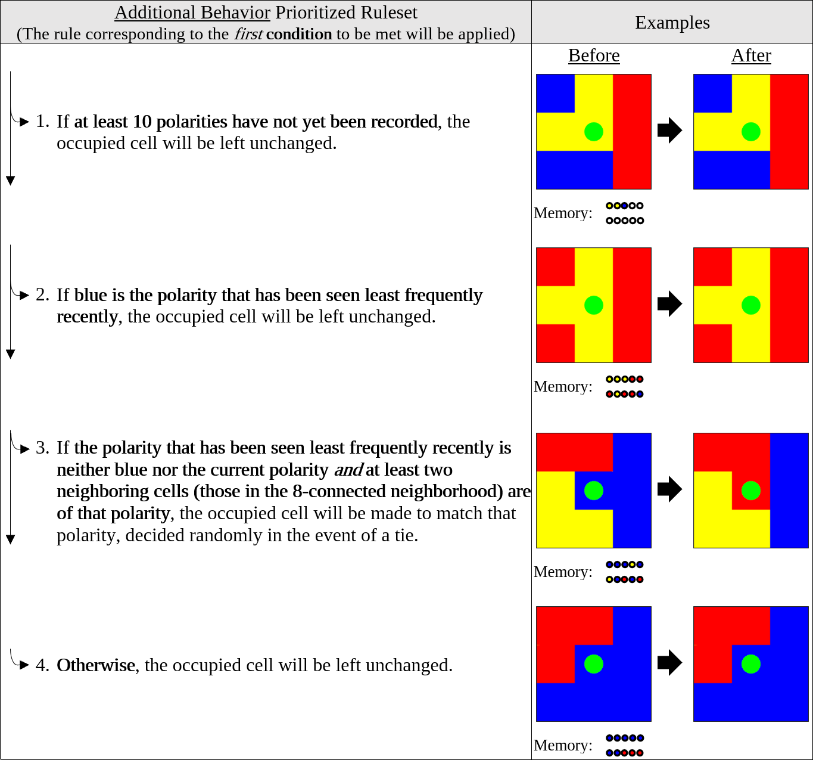

This tool simulates the behavior of a swarm of agents. It can be downloaded through Github using the following link:
https://github.com/rhoughtaling21/Swarm-Tool/releases/tag/v2020-Spring

The behavior of Standard Agents is determined by the prioritized ruleset described below.

The behavior of Equalizer Agents is determined by a separate prioritized ruleset, given below.

